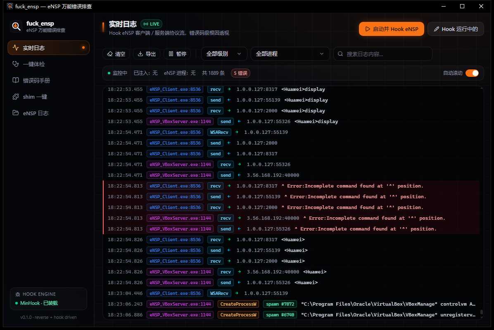
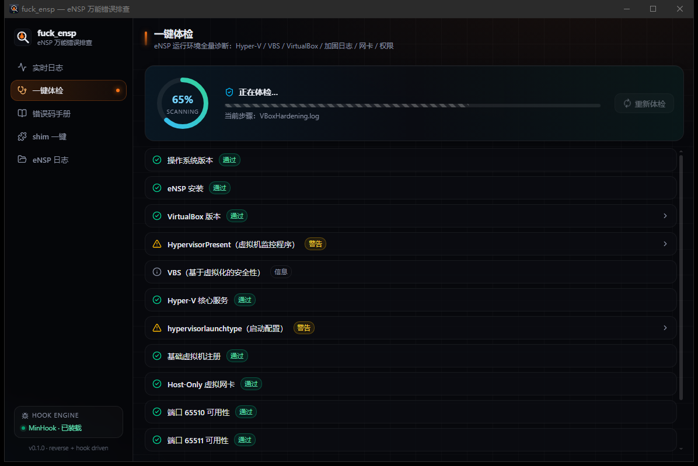
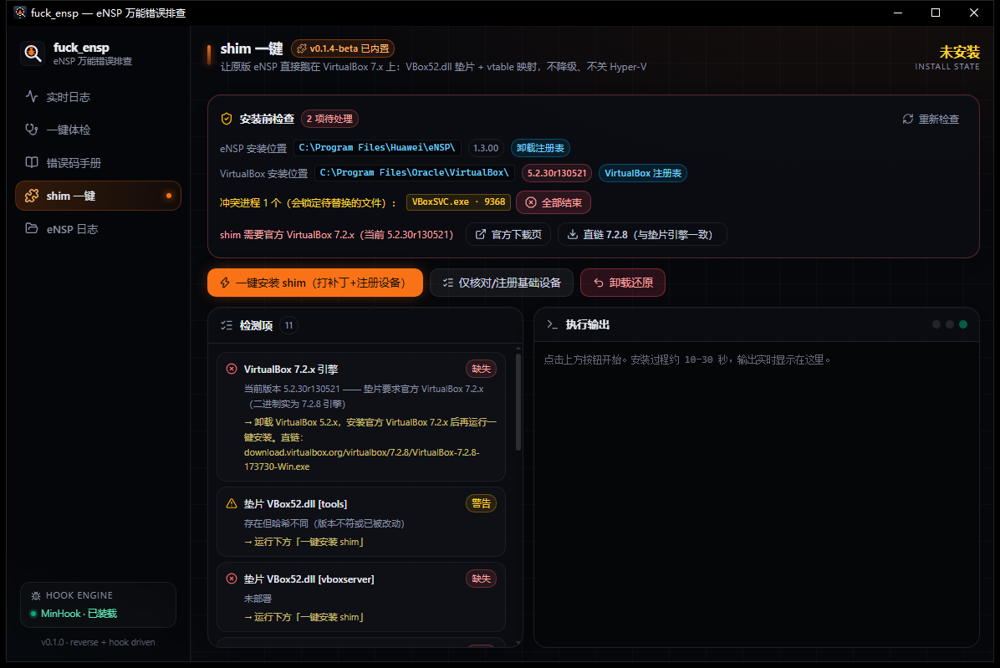

# fuck_eNSP

**eNSP 万能错误排查工具 —— 逆向 + Hook 驱动，让 40/41 错误码开口说话。**

eNSP 报错只会丢给你一个 `40` / `41` 数字，真正的根因埋在服务端内部。fuck_eNSP 通过 MinHook 注入 eNSP 客户端与服务端进程，把内部协议流、进程创建、错误详情全部实时吐出来；同时提供环境一键体检、错误码知识库、日志文件浏览器，并内置 [ensp-vbox-shim](https://github.com/LBXaaa/ensp-vbox-shim) 实现 VirtualBox 7.x 一键迁移。



## 功能

- **实时日志**：Hook `eNSP_Client.exe` / `eNSP_VBoxServer.exe` 的 WinSock、进程创建等 API，TCP 协议流（含 65510/65511/65514 端口 XML 报文）逐条透视，按进程 / 级别 / 关键字过滤，错误码一键跳转手册
- **一键体检**：15 项环境诊断——Hyper-V / VBS 状态、VirtualBox 版本、VBoxHardening.log 加固特征（`-5607` ntdll 不兼容检测）、网卡、端口占用、虚拟机注册，给出评分与修复步骤
- **错误码手册**：40 / 41 等错误码的根因与解决办法（来自逆向字符串表 + 社区经验）
- **shim 一键**：内置 ensp-vbox-shim v0.1.4-beta 整合包，安装前智能检测 eNSP / VirtualBox 安装位置（注册表 + 全盘搜索）、冲突进程自动结束、一键打垫片让 eNSP 跑在 VirtualBox 7.2.x 上
- **eNSP 日志**：VBoxHardening.log 等落盘日志直接浏览




## 使用

下载 [Release](https://github.com/TinggalLeaf/fuck_eNSP/releases) 里的便携版 zip，解压后运行 `fuck_ensp.exe`（需要管理员权限，用于进程注入）。

1. 打开「实时日志」页，点 **启动并 Hook eNSP**（或先开 eNSP 再点 **Hook 运行中的**）
2. 在 eNSP 里启动设备，观察协议流；报错行会出现红色 **错误码 N →**，点击跳手册
3. 环境有问题先跑「一键体检」，按修复建议处理

> eNSP 与 VirtualBox 5.2.x 在新版 Windows（ntdll ≥ 10.0.26100.9444）上会因加固自检不兼容报 40。根治方案是 VirtualBox 7.2.x + shim：装好 VBox 7.2.x 后到「shim 一键」页点 **一键安装 shim** 即可，垫片全程可逆。

## 技术栈

- **桌面框架**：Tauri 2 + React 19 + TypeScript + Vite
- **UI**：shadcn/ui 风格组件（Radix UI + Tailwind CSS v4）+ Framer Motion + lucide-react
- **Hook 引擎**：自研 32 位 MinHook DLL（`src-tauri/native/hook_dll`），GUI 子系统注入器（`src-tauri/native/inject_helper`），Rust 后端调度
- **垫片**：[LBXaaa/ensp-vbox-shim](https://github.com/LBXaaa/ensp-vbox-shim) v0.1.4-beta 内嵌发行版

## 构建

需要 Rust（i686/x86_64-pc-windows-msvc）、Node.js + pnpm：

```bash
pnpm install
pnpm tauri build
```

产物在 `src-tauri/target/release/bundle/`（MSI / NSIS），便携打包：`python scripts/make_portable.py`。

## 免责声明

本项目仅供学习与技术研究使用。eNSP 为华为产品，VirtualBox 为 Oracle 产品，相关商标归各自所有者。
